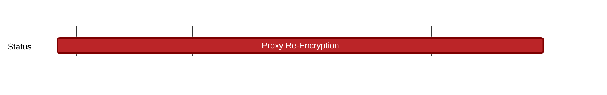

## `vac:acz:consulting:codex:proxy-re-encryption`
---

- status: 50%
- CC: Ramses + 1

### Description

To embed and assist codex with their proxy re-encryption primitive.
### Justification

Proxy re-encryption is necessary to provide plausible deniability to storage providers.

### Deliverables

- [x] A Document describing possible solutions: https://www.notion.so/Approaches-to-plausible-deniability-87c6fef92df946fcbc1327d51d936ce1?pvs=4
- [ ] Agreement and hardening of specification for the Codex team