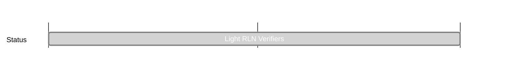

## `vac:acz:rlnp2p:vac:light-rln-verifiers`
---

- status: 100%
- CC: Aaryamann

### Description

Make use of cryptography techniques to improve trust assumptions and reduce off-chain complexity while verifying RLN proofs.
### Justification

A node attempting to verify RLN proofs takes nearly ~10 minutes to sync all the leaves. We should explore cost-effective solutions to make the root of the tree accessible onchain.

### Deliverables

- [x] PoC using tiered commitment trees: https://github.com/vacp2p/rln-contract/pull/37
- [x] Deployed to sepolia and load tested: https://sepolia.etherscan.io/address/0xE7987c70B54Ff32f0D5CBbAA8c8Fc1cAf632b9A5
- [x] Ethresearch post: https://ethresear.ch/t/tiered-commitment-trees-to-reduce-gas-costs-and-offchain-complexity/19484
- [x] Vac forum post: https://forum.vac.dev/t/light-rln-verifiers-using-a-tiered-commitment-tree/290
- [x] Vac blog post: https://vac.dev/rlog/rln-light-verifiers/

