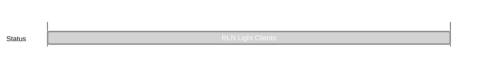

## `vac:acz:rlnp2p:vac:rln-light-clients`
---

- status: 100%
- CC: Aaryamann

### Description

Make use of zk-kit's [LazyIMT](https://github.com/privacy-scaling-explorations/zk-kit/blob/12447adf0bca1f752b1bd6b7acf5b87e0cadccc6/packages/imt.sol/contracts/LazyIMT.sol)to have the merkle proof of a leaf accessible onchain, and the root as well, to allow for light rln provers and verifiers.
### Justification

A node attempting to verify RLN proofs takes nearly ~10 minutes to sync all the leaves. We should attempt to see if it is cheap *enough* to use the LazyIMT structure so that we can have the merkle proof accessible onchain.

### Deliverables

- [x] PoC (rln-v1): https://github.com/vacp2p/rln-contract/pull/31
- [x] Deployed to cardona zkevm testnet: https://cardona-zkevm.polygonscan.com/address/0x16abffcab50e8d1ff5c22b118be5c56f801dce54
- [x] PoC (rln-v2): https://github.com/vacp2p/rln-contract/pull/39
- [x] Downstreamed to waku-rln-contract to estimate gas: https://github.com/vacp2p/rln-contract/pull/38

| RLN Version      | Gas estimate for insertion |
| ---------------- | -------------------------- |
| rln-v1           | 90k                        |
| rln-v1 (lazyIMT) | 130k                       |
| rln-v2           | 135k                       |
| rln-v2 (lazyIMT) | 210k                       |
