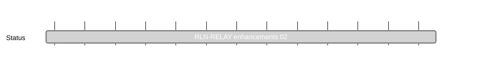

## `vac:acz:rlnp2p::waku:rln-relay-enhancements_02`
---

- status: 100%
- CC: Aaryamann

### Description

* continuation of [[rln-relay-enhancements|rln-relay-enhancements]]
* comprises further enhancements of RLN relay, requested by the Waku team

### Justification

### Risks

### Deliverables

