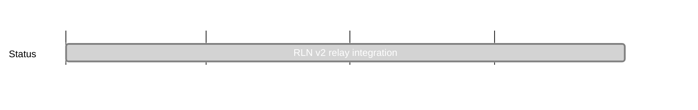

## `vac:acz:rlnp2p:waku:rlnv2-relay-integration`
---

- status: 100%
- CC: Aaryamann

### Description

* also involves
  - TKE
  - implemenations in various Waku versions

### Justification

rln-v2 brings multi message per epoch signaling which is favourable for all users of rln instead of abiding by one global rate limit. 

### Deliverables

- [x] https://github.com/waku-org/nwaku/issues/2345

