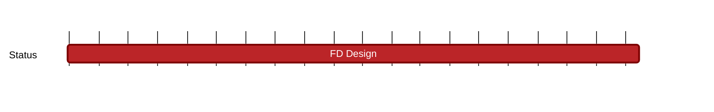

## `vac:acz:secure-channels:waku:fd-design`
---

- status: 5%
- CC: Ramses, Ugur

### Description

* follow up of [[vac/acz/secure-channels/waku/mls-design|mls-design]]

While MLS, an established protocol, allows us to quicker release a secure key setup protocol with an Ethereum authenticator,
MLS is federated in nature and makes reliability assumptions in regards to the underlying message dissemination layer.
We work towards mitigating this using on-chain components in the planned deliverables for the milestone linked above.

However, we still desire a fully decentralized version that ideally does not require an on-chain component.
This Milestone tracks this effort.

### Justification

### Deliverables

* specification (RFC)

