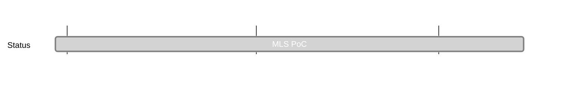

## `vac:acz:secure-channels:waku:mls-poc`
---

- status: 100%
- CC:
	- Ekaterina
	- Aaryamann

### Description

* proof of concept implementation of [[vac/acz/secure-channels/waku/mls-design|mls-design]]
* repo: https://github.com/vacp2p/de-mls
* issues: 
	* https://github.com/vacp2p/de-mls/issues/1
	* https://github.com/vacp2p/de-mls/issues/2
	* https://github.com/vacp2p/de-mls/issues/3

### Justification

### Deliverables

* Engineers implementing the researchers advice on how to proceed with the PoC
	- [x] https://github.com/vacp2p/de-mls/issues/1
	- [x] https://github.com/vacp2p/de-mls/issues/2
	- [x] https://github.com/vacp2p/de-mls/issues/3
	- [x] https://github.com/vacp2p/de-mls/issues/4
	- [x] https://github.com/vacp2p/de-mls/issues/5
	- [x] https://github.com/vacp2p/de-mls/issues/6

