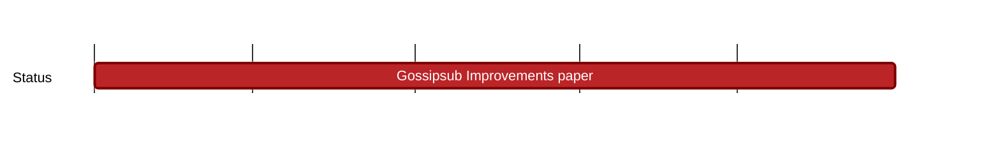

## `vac:dr:gsub-scaling:vac:gossipsub-improvements-paper`
---

- status: 70%
- CC: Farooq

### Description

[background + first results + potential improvements](https://hackmd.io/X1DoBHtYTtuGqYg0qK4zJw)

* comprehensive current/related work study on gossipsub scaling (including relevant work outside of gossipsub, in the broader area of unstructured P2P networks in general)
* complete technical report on gossip scaling / gossipsub improvements (containing, but not limited to, our previous research)
* research log post (vac.dev) based on the techreport
* talk @ Logos research call
* scientific paper ready for publication

### Justification

### Deliverables

