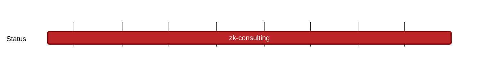

## `vac:dr:zk:codex:zk-consulting`
---

- status: 10%
- CC: Marvin

### Description

This Milestone comprises deep research ZK consulting for Codex:
Here is a high level description of Codex ZK research problems:  https://hackmd.io/1IZiFSiYSdyrbaKxKeUevg

1) summarizing existing research relevant for us (exactly which papers is kind of dynamically determined), in form of PDF notes and face-to-face explanations. We agreed with Marvin that this is probably the easiest way to get something going
2) finding a suitable set commitment scheme (for tracking which proofs are present / not present in an aggregated proof)
3) figuring out the details of recursion for elliptic-curve-and-pairing based schemes (while this is solved, more clarity on this is required)

Regarding 3): Even if we end up using a non EC scheme for "large data", KZG (and thus EC pairings) seems to be a much better choice for "small data",
so we will probably need this in any case (unless we can efficiently verify KZG proofs in a small field / FRI setting).

Some of these tasks are explorative. Expected outputs are regular reports.

A follow-up milestone for the next reporting period is expected.

### Justification

### Deliverables

* regular reports.

