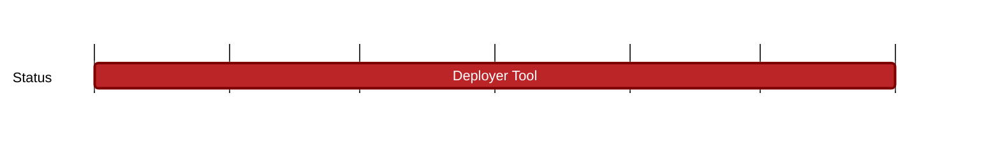

## `vac:dst:tooling:vac:deployer-tool`
---

- status: 90%
- CC: Alberto, Wings

### Description

A first version of tool that allows deploying >10k gossipsub / waku relay nodes.

The tool should measure bandwidth usage per node and bundle the measurement data for analysis.

The tool should be built in such a way that it can be used for other deployments as well.

It should allow automated, repeatable and accountable deployments.

### Justification

### Deliverables

* https://github.com/vacp2p/10ksim
* https://github.com/vacp2p/vaclab/argocd
