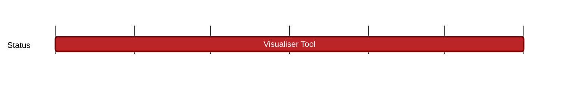

## `vac:dst:tooling:vac:visualiser-tool`
---

- status: 75%
- CC: Alberto, Alberto

### Description

The visualiser tools are two tools that can be used for visualising the message flow of a Waku network. They are adaptable to other network types too (particularly Nomos, Codex).

They rely on either Grafana Loki or VictoriaLogs to store and query logs.

The live visualiser is used for viewing the network in real time.

The debug visualiser is used for viewing a deployment that has already taken place.

### Justification
To make it easy and intuitive to understand the message flow and propagation patterns and properties of a Waku network and apply that same understanding to other networks.

### Deliverables

A peer to peer network mapper that creates a visualisation something like this:

The tool should be able to visualise the message flow of a Waku network, by lighting up nodes in a graph as they receive messages, flashing a different colour for each message (or message type).

The live visualiser is feature complete, needing only minor tweaks and bug fixes:
https://github.com/vacp2p/dst-live-visualiser

The debug visualiser is still under development, but the core functionality is available already.