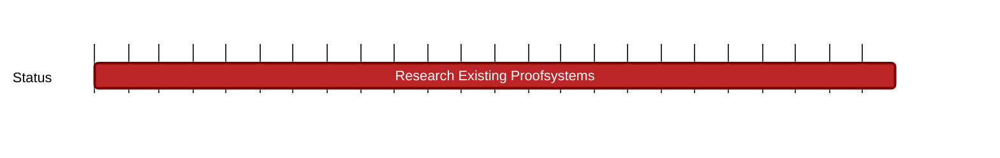

## `vac:nes:proofsystems:vac:research-existing-proofsystems`
---

- status: ongoing
- CC: team

### Description

This milestone demonstrates our commitment to a continuous and long-term effort aimed at the comprehensive analysis and study of various proof systems, both established and emerging.
The primary objective is to maintain cutting-edge relevance by staying alongside of the latest developments in proof systems, ensuring our projects are at the forefront of privacy technology.
This is important for sustaining our competitive edge and fostering innovation within our projects.
This milestone is foundational to our strategy, enabling us to swiftly adapt to new technologies and incorporate groundbreaking methods that enhance our privacy objectives.

### Work Breakdown

Our approach involves a systematic review of current and nascent proof systems, identifying those with the potential to advance our research and project goals.
This includes evaluating their applicability, efficiency, and the privacy enhancements they offer.
By doing so, we aim to uncover novel insights and techniques that can be integrated into our work, furthering our mission to deliver robust privacy solutions.

### Deliverables

* Blog posts
* Potential benchmarks

**Impact:** The ongoing research and analysis conducted under this milestone are expected to yield multiple benefits:
identification of promising proof systems that could revolutionize our approach to privacy, generation of innovative ideas for future development,
and ensuring our projects remain relevant and impactful in the rapidly advancing field of blockchain and privacy technologies.
This milestone is valuable both internally and externally. Within our organization, it caters to the diverse needs of various teams that utilize proof systems for distinct purposes.
Similarly, it offers the scientific community access to essential insights across different systems without the need to delve into each one individually.

