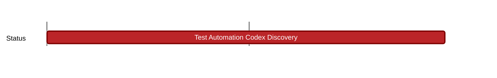

## `vac:qa::codex:test-automation-codex-discovery`
---

- status: 0%
- CC: Florin

### Description

- The goal of this milestone is to check unit and integration coverage of [nim-codex](https://github.com/codex-storage/nim-codex) and other repos in [Codex org](https://github.com/codex-storage) which nim-codex depends on.
- Deliverables will be a document showcasing existing testing coverage, gaps, CI capabilities and recommended improvements.

### Justification

### Deliverables
