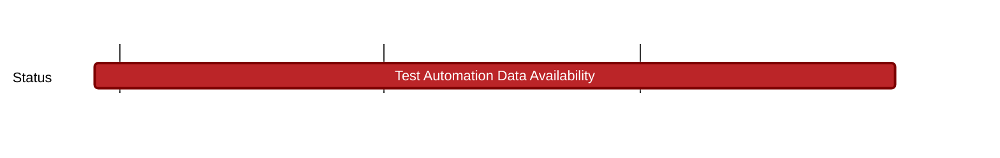

## `vac:qa::nomos:test-automation-data-availability`
---

- status: 0%
- CC: Florin, Roman

### Description

- Test plan
- Unit tests
- Integration tests
- Performance tests

### Justification

### Deliverables
