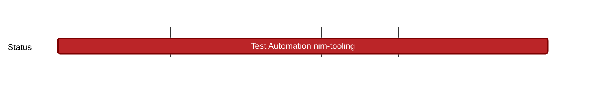

## `vac:qa::vac:test-automation-nim-tooling`
---

- status: 0%
- CC: Roman, Alex, Florin

### Description

- build process testing
- contribution to Nim devel docker images
- Nimble/Nim features testing
- collect feedback from devs -> create issues

### Justification

### Deliverables
