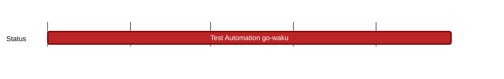

## `vac:qa::waku:test-automation-go-waku`
---

- status: 100%
- CC: Roman

### Description

* filter (t)
* lightpush (t)
* store (t)
* relay
* peer exchange
* discv5
* peer & connection management
* CI integration

### Justification

### Deliverables

- filter:
  - https://github.com/waku-org/go-waku/blob/master/waku/v2/protocol/filter/filter_ping_test.go
  - https://github.com/waku-org/go-waku/blob/master/waku/v2/protocol/filter/filter_proto_ident_test.go
  - https://github.com/waku-org/go-waku/blob/master/waku/v2/protocol/filter/filter_push_test.go
  - https://github.com/waku-org/go-waku/blob/master/waku/v2/protocol/filter/filter_subscribe_test.go
  - https://github.com/waku-org/go-waku/blob/master/waku/v2/protocol/filter/filter_test.go
  - https://github.com/waku-org/go-waku/blob/master/waku/v2/protocol/filter/filter_unsubscribe_test.go

- lightpush:
  - https://github.com/waku-org/go-waku/blob/master/waku/v2/protocol/lightpush/waku_lightpush_test.go

- store:
  - https://github.com/waku-org/go-waku/blob/master/waku/v2/protocol/store/waku_store_client.go
  - https://github.com/waku-org/go-waku/blob/master/waku/v2/protocol/store/waku_store_protocol_test.go
  - https://github.com/waku-org/go-waku/blob/master/waku/v2/protocol/store/waku_store_query_test.go

- relay:
  - https://github.com/waku-org/go-waku/blob/master/waku/v2/protocol/relay/waku_relay_test.go

- peer exchange:
  - https://github.com/waku-org/go-waku/blob/master/waku/v2/protocol/peer_exchange/waku_peer_exchange_test.go

- peer & connection management:
  - https://github.com/waku-org/go-waku/blob/master/waku/v2/peermanager/connection_gater_test.go
  - https://github.com/waku-org/go-waku/blob/master/waku/v2/peermanager/service_slot_test.go
  - https://github.com/waku-org/go-waku/blob/master/waku/v2/peermanager/topic_event_handler_test.go

- discv5
  - https://github.com/waku-org/go-waku/blob/master/waku/v2/discv5/discover_test.go

- CI integration
  - https://github.com/waku-org/waku-interop-tests/actions/workflows/test_common.yml
  - go_waku_daily which is now changed.

