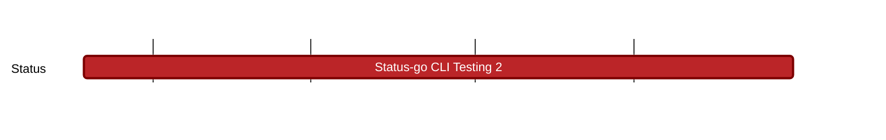

## `vac:qa::waku:status-go-cli-testing-2`
---

- status: 0%
- CC: Florin

### Description

- Review the current test coverage of chat functionalities in status-go and proceed with further coverage. Start with community creation and usage in dedicated shards 
- Review testing in status-go related to chat functionalities that rely on external systems (e.g., Waku fleet) and migrate them to an interoperable testing framework. Decouple CI tests from external/unreliable fleets
- TBD (discussions are still ongoing, Hanno will reach out to Status people to define the requirements)
  
### Justification

### Deliverables

  
