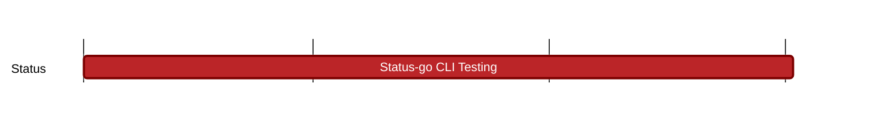

## `vac:qa::waku:status-go-cli-testing`
---

- status: 100%
- CC: Florin

### Description

* Testing the reliability of message sending via the status-go CLI tool. See [details](https://docs.google.com/document/d/1L8HvXtAYk-JqQL6w3RgCskXwegcTa0J5nyH9YL4LrQE/edit#heading=h.q8bx3xjzsxn9) 
* [Ticket](https://github.com/status-im/status-go/issues/5144)
* Potential [tool](https://github.com/status-im/status-go/blob/develop/cmd/status-cli/README.md) to use
  
### Justification

### Deliverables

- Created [new framework](https://github.com/status-im/status-cli-tests) that:
  - builds and runs nodes using status cli tool
  - provides API to interact with different features
  - runs tests for all requested features:
    - contact_request
    - create_private_groups
    - fetch_community
    - join_community
    - leave_community
    - one_to_one_messages
    - private_group_messages
  - reuses communities to not clout the staging env
  - runs each night on status master branch
  - generates test report with history: https://status-im.github.io/status-cli-tests/122/
  - found multiple issues that are under investgation by Pablo
- Ability to simulate for all the above scenarios:
  - Latency
  - Packet loss
  - Low bandwith
  - Hybernation
  
### PR list:
- https://github.com/status-im/status-cli-tests/pull/1
- https://github.com/status-im/status-cli-tests/pull/2
- https://github.com/status-im/status-cli-tests/pull/3
- https://github.com/status-im/status-cli-tests/pull/4
- https://github.com/status-im/status-cli-tests/pull/5
- https://github.com/status-im/status-cli-tests/pull/6
