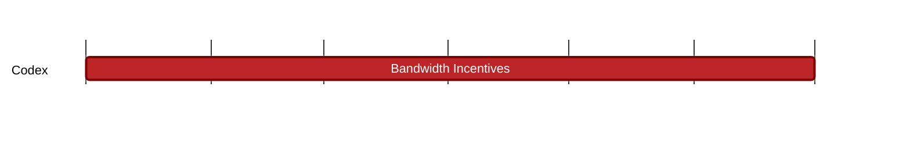

### `vac:tke::codex:bandwidth-incentives`
---

- status: 0%
- CC: Frederico

### Description
TBD

### Justification
As part of Codex Technical Milestones #4 ("Bandwidth Incentives").

### Deliverables
- Modeling and Simulations
- Report

### Tracking Metrics
- Timely delivery of the report
- Agreement with Codex team and stakeholders

### Work breakdown
- Review of Bandwidth Provider role
- Analysis of Bandwidth Provider costs, pricing, behavior and expectations
- Economics and game theoretical analyses of the Bandwidth Providers

### Perceived Risks
Technical and legal constraints.
