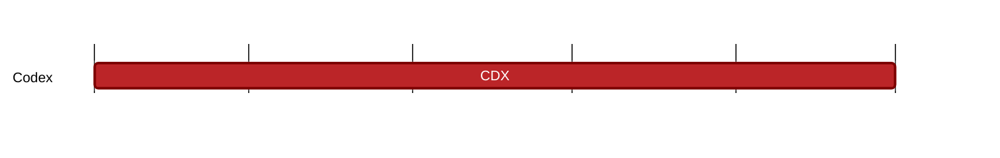

### `vac:tke::codex:cdx`
---

- status: 95%
- CC: Frederico

### Description
Codex token as utility token for all participants (collateral and payment), impact on system security.

### Justification
Development of Codex own utility token. As part of the Codex Technical Milestone #5 ("Tokenomics").

### Deliverables
- Specific parts of three chapters of the Codex Litepaper (Use Cases, Contract Lifecycle, and CDX Tokenomics) (the milestones [cdx-fees](cdx-fees.md), [cdx-insurance](cdx-insurance.md), and [cdx-lender](cdx-lender.md) cover the remaining parts of these chapters).
- One section of the Codex Whitepaper (CDX Tokenomics)

### Tracking Metrics
Completion of the respective sections in the Codex Litepaper and Whitepaper.

### Work breakdown
- Definition and analysis of Codex economy
- CDX as utility token for all participants (collateral and payment).

### Perceived Risks
Technical and legal constraints.
