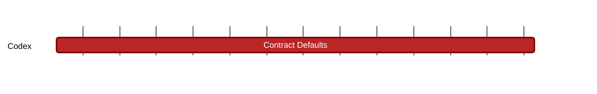

### `vac:tke::codex:contract-defaults`
---

- status: 0%
- CC: Frederico

### Description
Design of the systemic slashing mechanism.

### Justification
As part of Codex Technical Milestones #3 ("Marketplace Interactions").

### Deliverables
- Modeling and Simulations of the slashing mechanisms
- One section of the Codex Litepaper "Modeling" chapter (the milestones [contract-finalization](contract-finalization.md), [contract-initiation](contract-initiation.md), [contract-matching](contract-matching.md), [proof-aggregators](proof-aggregators.md), [recovery-auction](recovery-auction.md), [slot-repair](slot-repair.md), and [tax-system](tax-system.md) cover the remaining parts of this chapter).

### Tracking Metrics
- Timely delivery of the report
- Agreement with Codex team and stakeholders

### Work breakdown
- Review consequences for SPs, Clients and PAs
- Economic and game theoretical analysis of these consequences

### Perceived Risks
Technical and legal constraints.
