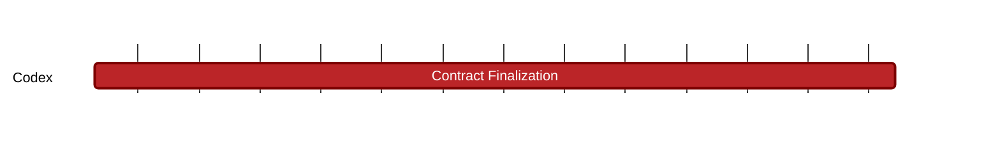

### `vac:tke::codex:contract-finalization`
---

- status: 0%
- CC: Frederico

### Description
SPs & Users obligations, data retrieval incentives, collateral retrieval, contract extension.

### Justification
As part of the contract finalization process. As part of Codex Technical Milestones #3 ("Marketplace Interactions").

### Deliverables
- Modeling and Simulations of the data retrieval process
- One section of the Codex Litepaper "Modeling" chapter (the milestones [contract-initiation](contract-initiation.md), [contract-matching](contract-matching.md), [contract-defaults](contract-defaults.md), [proof-aggregators](proof-aggregators.md), [recovery-auction](recovery-auction.md), [slot-repair](slot-repair.md), and [tax-system](tax-system.md) cover the remaining parts of this chapter).

### Tracking Metrics
- Timely delivery of the report
- Agreement with Codex team and stakeholders

### Work breakdown

### Perceived Risks
Technical and legal constraints.

