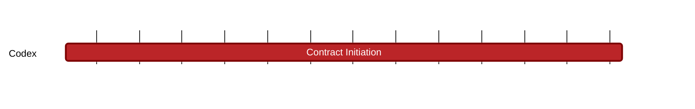

### `vac:tke::codex:contract-initiation`
---

- status: 0%
- CC: Frederico

### Description
Mechanics of Codex contract initiation.

### Justification
As part of Codex Technical Milestones #3 ("Marketplace Interactions").

### Deliverables
- Modeling and Simulations of the Client behavior
- One section of the Codex Litepaper "Modeling" chapter (the milestones [contract-matching](contract-matching.md), [contract-defaults](contract-defaults.md), [contract-finalization](contract-finalization.md), [proof-aggregators](proof-aggregators.md), [recovery-auction](recovery-auction.md), [slot-repair](slot-repair.md), and [tax-system](tax-system.md) cover the remaining parts of this chapter).

### Tracking Metrics
- Timely delivery of the report
- Agreement with Codex team and stakeholders

### Work breakdown
- Definition of default settings
- Facilitate the matching of pricing and collateral size
- Analysis of client payment (full vs. partial upfront)
- Analysis of potential gamifications and penalties

### Perceived Risks
Technical and legal constraints.
