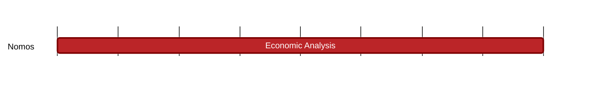

## `vac:tke::nomos:cryptarchia-wealth-concentration-estimated-stake`
---

- status: 100%
- CC: Frederico

### Description

Understand whether the algorithm that learns the total stake of the system affects wealth concentration. If so, under which conditions.

### Justification

Nomos develops a private PoS system.
