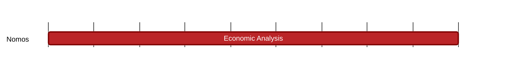

## `vac:tke::nomos:cryptarchia-wealth-concentration-known-stake`
---

- status: 100%
- CC: Frederico

### Description

Understand whether wealth concentration happens or not in traditional PoS. If so, under which conditions.

### Justification

Nomos introduces a PoS system.
