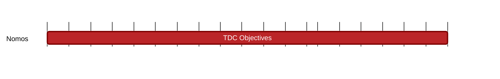

## `vac:tke::nomos:tdc-objectives`
---

```mermaid
%%{ 
  init: { 
    'theme': 'base', 
    'themeVariables': { 
      'primaryColor': '#BB2528', 
      'primaryTextColor': '#fff', 
      'primaryBorderColor': '#7C0000', 
      'lineColor': '#F8B229', 
      'secondaryColor': '#006100', 
      'tertiaryColor': '#fff' 
    } 
  } 
}%%
gantt
	dateFormat YYYY-MM-DD 
	section Nomos
		TDC Objectives :, 2024-02-05, 2024-03-13
```
- status: 70%
- CC: Frederico

### Description

Write the Objectives & Requirements section of the Token Design Canvas.

### Justification
