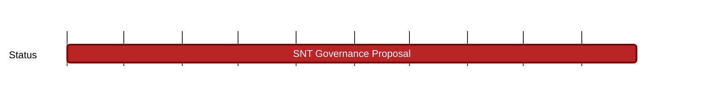

## `vac:tke::status:SNT-governance-proposal`
---

- status: 50%
- CC: Martin

## Description

* took precedence over SNT litepaper
* first draft being prepared for next review with John on 2023/09/12
* organizing snapshot voting

## Justification

* Per John’s request, high importance for involving community for relaunch of Status app and refresh of SNT token
