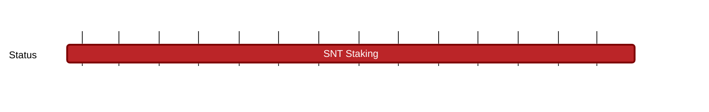

## `vac:tke::status:SNT-staking`
---

- status: 90%
- CC: Frederico (Python), Martin
- collab: [[vac/sc/index|smart contracts team]]

### Description:

### Risks

* implementation of the smart contract is being handed off to smart contract team

