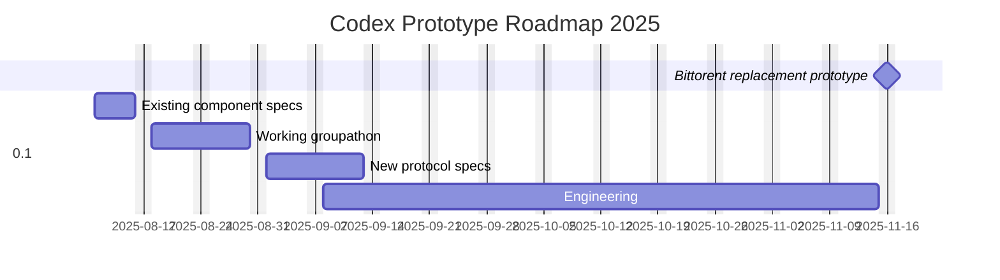

## Week 32 August 2025

### nim libs

* Complete the ABI encoder / decoder PR (https://github.com/status-im/nim-web3/pull/216)
  * Fix offsets encoding issue
  * Use `nim-fastream` api advance to avoid loading the whole buffer in memory for dynamic data
  * Apply PR's feedback (comments, handling int overflow decoding...)
  * Replace the old encode / decode functions by the new decoder in nim-web3
  * Test in eth1 (https://github.com/status-im/nimbus-eth1/pull/3554)
  * Testing in eth2 and nwaku (in progress)

### Altruistic mode

#### Status desktop requirements

Status desktop requirements FURPs PR has been created: https://github.com/status-im/status-desktop/pull/18483)

#### New altruistic design ideas

* Eric -- [replication network alternative](https://hackmd.io/@codex-storage/BkN_REgulx)
* Eric -- [replication network alternative -- over simplified assumptions](https://hackmd.io/@codex-storage/S1DWaqW_ex)
* Balazs -- additions to the [altruistic musings](https://hackmd.io/jN6IN1qQQyaVSt9uGhHu9Q)

### Specs

Kicked off specs effort for existing modules.
Template: https://hackmd.io/@codex-storage/rkbytlbOxg
Kanban of components to spec:
https://github.com/orgs/codex-storage/projects/6/views/1
Due 15 August
Specs will be contained in https://github.com/codex-storage/codex-docs-obsidian

### Offsite

Have more or less decided on mid-November for the offsite, to come after a
prototype is delivered, as there is not a lot of other convenient times due to
holidays and other availability considerations (eg paternity leave). Location
will be in Europe to keep costs down. Initial idea is Canary Islands but could
move to more central Europe to drop costs further.

### Roadmap

We are working towards a roadmap that replaces bittorrent in status-go with
a prototype of the new Codex.

1. Write existing component specs, 11-15 August
2. Create a new design validated by the requirements. Deliver roadmap. (working
   groupathon), 18-29 August
3. Write specs for new protocol design, 1-12 Sept
4. Start engineering, deliver BT replacement *prototype* in `status-go`, 8 September-14 Nov

### Solutions engineering

* Updates to constellations prototype: automatic support feature, stability improvements.

### Research

* Completed hotspot calculations for Zipf-based query distribution.
* Researched on Dandelion++ (Stem & Fluff) based protocols
* [Altruistic musings](https://hackmd.io/jN6IN1qQQyaVSt9uGhHu9Q)
