> [!NOTE] This chart is automatically generated from the content within this repository. All projected timelines and deliverables are provided for informational purposes only and are subject to change without notice.

```mermaid
gantt
    dateFormat YYYY-MM-DD
    
    section Storage
    Basic File Sharing Client for Logos Core       :active, storage1, 2025-01-01, 2026-02-28
    click storage1 href "/storage/roadmap/frontends-filesharing-rme"
    Privacy-Preserving File Sharing                :storage2, 2025-11-01, 2026-10-31
    click storage2 href "/storage/roadmap/privacy-preserving-filesharing-rme"
    
    section LogosCore
    LogosApp Installer                             :active, lc1, 2025-01-01, 2026-03-31
    click lc1 href "/logoscore/roadmap"
    Package Format & Manifest                      :active, lc2, 2025-03-01, 2026-03-31
    click lc2 href "/logoscore/roadmap"
    Package Manager                                :active, lc3, 2025-06-01, 2026-03-31
    click lc3 href "/logoscore/roadmap"
    Module Loading/Code-signing & Packaging        :active, lc4, 2025-06-01, 2026-03-31
    click lc4 href "/logoscore/roadmap"
    QML Module UI Apps                             :active, lc5, 2025-09-01, 2026-03-31
    click lc5 href "/logoscore/roadmap"
    Test QtWebview UI Module with API              :active, lc6, 2025-09-01, 2026-03-31
    click lc6 href "/logoscore/roadmap"
    Mobile App for iOS and Android                 :active, lc7, 2025-06-01, 2026-06-30
    click lc7 href "/logoscore/roadmap"
    Develop modules & test apps                    :active, lc8, 2025-09-01, 2026-06-30
    click lc8 href "/logoscore/roadmap"
    
    section Blockchain - March Testnet
    LSSA Sovereign Rollup                          :active, bc1, 2025-01-01, 2026-03-31
    click bc1 href "/blockchain/roadmap/lssa_sovereign_rollup"
    LSSA Resilience                                :active, bc2, 2025-01-01, 2026-03-31
    click bc2 href "/blockchain/roadmap/lssa_resilience"
    LSSA Program Interface                         :active, bc3, 2025-01-01, 2026-03-31
    click bc3 href "/blockchain/roadmap/lssa_program_interface"
    LSSA Logos Core Integration                    :active, bc4, 2025-01-01, 2026-03-31
    click bc4 href "/blockchain/roadmap/lssa_logos_core"
    Blockchain Logos Core Integration              :active, bc5, 2025-01-01, 2026-03-31
    click bc5 href "/blockchain/roadmap/blockchain_logos_core"
    SDP Implementation                             :active, bc6, 2025-01-01, 2026-03-31
    click bc6 href "/blockchain/roadmap/blockchain_sdp"
    Cryptarchia Implementation                     :active, bc7, 2025-01-01, 2026-03-31
    click bc7 href "/blockchain/roadmap/blockchain_cryptarchia"
    Blend Network                                  :active, bc8, 2025-01-01, 2026-03-31
    click bc8 href "/blockchain/roadmap/blockchain_blend"
    Wallet Implementation                          :active, bc9, 2025-01-01, 2026-03-31
    click bc9 href "/blockchain/roadmap/blockchain_wallet"
    
    section Blockchain - June Testnet
    Bridge Logos Token L1-LSSA                     :bc10, 2025-12-01, 2026-06-30
    click bc10 href "/blockchain/roadmap/bridging"
    LSSA Decentralized Sequencing                  :bc11, 2025-12-01, 2026-06-30
    click bc11 href "/blockchain/roadmap/decentralized_sequencing"
    Blend Broadcaster Censorship Resistance        :bc17, 2025-06-01, 2026-06-30
    click bc17 href "/blockchain/roadmap/blend_broadcaster_censorship"
    LogosDA Bandwidth Efficient DA                 :bc25, 2025-06-01, 2026-06-30
    click bc25 href "/blockchain/roadmap/logosda_bandwidth_efficient"
    Cryptarchia Stake Inference                    :bc20, 2025-06-01, 2026-06-30
    click bc20 href "/blockchain/roadmap/cryptarchia_stake_inference"
    Testing Framework                              :active, bc21, 2025-03-01, 2026-06-30
    click bc21 href "/blockchain/roadmap/testing_framework"
    
    section Blockchain - Parallel
    Cross Sovereign Rollup Messaging               :bc12, 2025-12-01, 2026-12-31
    click bc12 href "/blockchain/roadmap/cross_sovereign_rollup_messaging"
    LSSA Unify Private/Public Execution            :bc13, 2025-06-01, 2026-12-31
    click bc13 href "/blockchain/roadmap/lssa_unify_execution"
    LSSA Cross Program Calls                       :active, bc14, 2025-06-01, 2026-12-31
    click bc14 href "/blockchain/roadmap/lssa_cross_program_calls"
    LSSA Resolve State Contention                  :bc15, 2025-06-01, 2026-12-31
    click bc15 href "/blockchain/roadmap/lssa_state_contention"
    Blend Message Compression                      :bc16, 2025-06-01, 2026-03-31
    click bc16 href "/blockchain/roadmap/blend_message_compression"
    Blend Edge Node Privacy                        :bc18, 2025-06-01, 2026-12-31
    click bc18 href "/blockchain/roadmap/blend_edge_node_privacy"
    Areon Finality Model                           :active, bc19, 2025-06-01, 2026-03-31
    click bc19 href "/blockchain/roadmap/areon_finality"
    Cryptareon                                     :bc22, 2025-06-01, 2026-12-31
    click bc22 href "/blockchain/roadmap/cryptareon"
    Decentralized Block Building                   :bc23, 2025-06-01, 2026-12-31
    click bc23 href "/blockchain/roadmap/decentralized_block_building"
    LogosDA Resilient Sampling                     :active, bc24, 2025-06-01, 2026-03-31
    click bc24 href "/blockchain/roadmap/logosda_resilient_sampling"
    LogosDA Private DA                             :bc26, 2025-06-01, 2026-12-31
    click bc26 href "/blockchain/roadmap/logosda_private_da"
    Zones Design                                   :active, bc27, 2025-06-01, 2026-12-31
    click bc27 href "/blockchain/roadmap/zones_design"
    Crypto Audit                                   :active, bc28, 2025-06-01, 2026-12-31
    click bc28 href "/blockchain/roadmap/blockchain_crypto_audit"
    
    section AnonComms - Priority
    Basic Capability Discovery Module              :crit, active, ac1, 2025-01-01, 2026-03-31
    click ac1 href "/anoncomms/roadmap/create_basic_capability_discovery_module"
    Establish libp2p Mixnet                        :crit, active, ac2, 2025-01-01, 2026-03-31
    click ac2 href "/anoncomms/roadmap/establish_libp2p_mixnet"
    
    section AnonComms - Other
    Deliver de-MLS for p2p Group Messaging         :active, ac3, 2025-06-01, 2026-01-31
    click ac3 href "/anoncomms/roadmap/deliver_de-mls_api"
    MVP Payment Protocol                           :active, ac4, 2025-06-01, 2026-03-31
    click ac4 href "/anoncomms/roadmap/implement_mvp_payment_protocol"
    Public Zerokit 1.0 API                         :active, ac5, 2025-06-01, 2026-01-31
    click ac5 href "/anoncomms/roadmap/deliver_public_zerokit_1.0_api"
    RLN Prover for Gasless L2                      :active, ac6, 2025-06-01, 2026-01-31
    click ac6 href "/anoncomms/roadmap/release-rln-prover_for_gasless_l2"
    RLN Membership Allocation Service              :ac7, 2026-01-01, 2026-05-31
    click ac7 href "/anoncomms/roadmap/implement_rln_membership_allocation"
    
    section Messaging - Launch Critical
    Create Chat SDK MVP                            :crit, active, msg1, 2025-06-24, 2025-12-31
    click msg1 href "/messaging/roadmap/milestones/2026-chat-foundations"
    Extend Chat SDK with Group Conversations       :crit, msg2, 2025-12-18, 2026-06-30
    click msg2 href "/messaging/roadmap/milestones/2026-chat-developer-preview"
    API access to P2P Reliability for Desktop      :active, msg3, 2025-07-03, 2025-08-31
    click msg3 href "/messaging/roadmap/milestones/2026-messaging-api-developer-preview"
    Package SDS in Reliable Channel API            :msg4, 2025-12-10, 2026-03-31
    click msg4 href "/messaging/roadmap/milestones/2026-reliable-channel-api-developer-preview"
    Enable easy C-Bindings for Desktop             :active, msg5, 2025-12-19, 2026-03-31
    click msg5 href "/messaging/roadmap/milestones/2026-initial-integration-to-logos-core"
    
    section Messaging - Launch Important
    Support Discovery Research & Libp2p QUIC       :msg6, 2025-12-03, 2026-06-30
    click msg6 href "/messaging/roadmap/milestones/2025-support-discovery-research-and-libp2p-quic"
    Add Edge Mode to Messaging API                 :msg7, 2025-12-10, 2026-06-30
    click msg7 href "/messaging/roadmap/milestones/2025-add-edge-mode-to-messaging-api"
    Enable easy C-Bindings for Mobile              :active, msg8, 2025-12-19, 2026-06-30
    click msg8 href "/messaging/roadmap/milestones/2025-enable-easy-c-bindings-for-mobile"
    Messaging and Chat on Mobile                   :msg9, 2025-12-11, 2026-06-30
    click msg9 href "/messaging/roadmap/milestones/2025-messaging-chat-on-mobile"
    Complete Reliable Channel API                  :msg10, 2025-12-17, 2026-06-30
    click msg10 href "/messaging/roadmap/milestones/2026-reliable-channel-api-beta"
    Implement RLN Membership Management            :active, msg11, 2025-09-30, 2026-03-31
    click msg11 href "/messaging/roadmap/milestones/2025-implement-rln-membership-management"
    Add Support of RLN LSSA                        :msg12, 2026-01-01, 2026-09-30
    click msg12 href "/messaging/roadmap"
    
    section Messaging - Status
    Foundation for Communities Optimization        :active, msg13, 2024-09-07, 2025-10-31
    click msg13 href "/messaging/roadmap/milestones/2025-foundation-for-communities-optimization"
    Integrate nwaku in Status Desktop              :active, msg14, 2025-10-17, 2025-12-31
    click msg14 href "/messaging/roadmap/milestones/2024-nwaku-in-status-desktop"
    E2E Reliability in Status Communities          :active, msg15, 2024-09-07, 2025-12-31
    click msg15 href "/messaging/roadmap/milestones/2024-e2e-reliability-protocol"
    Nwaku in Status Mobile & Light Mode            :active, msg16, 2025-01-10, 2026-06-30
    click msg16 href "/messaging/roadmap/milestones/2025-nwaku-in-status-mobile"
```

## Legend

- **Red bars (crit)**: High priority / critical path items
- **Blue bars (active)**: Currently in progress
- **Gray bars**: Planned milestones
- **Click any bar** to navigate to the detailed milestone page

## Teams Overview

| Team | Milestones | Focus Areas |
|------|------------|-------------|
| **Storage** | 2 | File sharing, privacy-preserving storage |
| **LogosCore** | 8 | App installer, package management, mobile |
| **Blockchain** | 28 | LSSA, testnets, DA, consensus |
| **AnonComms** | 7 | Mixnet, capability discovery, RLN |
| **Messaging** | 16 | Chat SDK, reliability, Status integration |

## Key Dates

### Q1 2026 (Jan-Mar)
- **AnonComms**: de-MLS API, Zerokit 1.0 API, RLN Prover for Gasless L2 target completion
- **Blockchain**: March Testnet milestones (LSSA, Blend, Cryptarchia, Wallet)
- **Storage**: Basic File Sharing Client target completion (Feb 2026)

### Q2 2026 (Apr-Jun)
- **Blockchain**: June Testnet milestones (Bridging, Decentralized Sequencing)
- **AnonComms**: RLN Membership Allocation Service target completion
- **Messaging**: Group Conversations, Mobile support

### Q3-Q4 2026
- **Storage**: Privacy-Preserving File Sharing target completion (Oct 2026)
- **Blockchain**: Parallel milestones (Zones, Private DA, Cross-Rollup Messaging)
