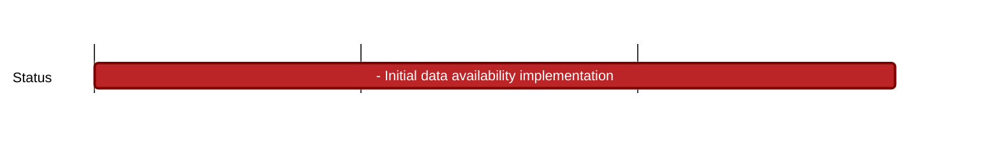

## `nomos:data-availability:`
---

### Description

Nomos Data Availability design:
- Our Base Layer doesn't have execution. Only the (global) Coordination Layer has a minimal set of operations.
- Our rollups are quasi-sovereign, meaning that they do not prove their state to the Base Layer, but they have to prove asset deposit/withdrawals, as well as implement the mechanism to pay for using the Base Layer DA+consensus. _Note that full sovereignty means no bridging and implementing a client of the DA for the payments._
- We also have a form of PBS, but enshrined in the L2s. The Base Layer only performs consensus on data that has been dispersed by the Builder. The Proposer is a node in the Base Layer, and the Builder is a node of the Execution Zone.
### Research

- Data Availability Specification: https://www.notion.so/Data-Availability-Specification-wip-c3961b681eba4ccdab2be9181e4207b4 

### Engineering

