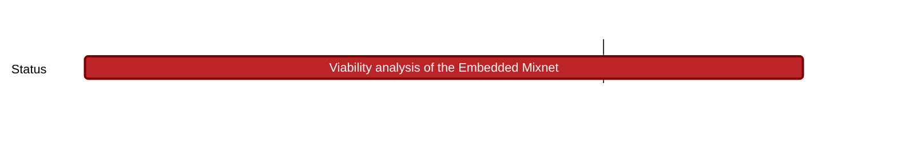
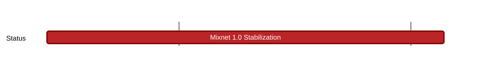

## `nomos:network-privacy:`
---

### Current Focus

**Mixnet 1.0** - a technology/system that helps keep information sent over the internet private and secure. It does so by mixing up data from different sources before sending it to its destination. In Nomos chain:
- Mixnet nodes opt-in by publishing their IP and providing stake.
- The mixnet topology of layers is public and defined on-chain (by some deterministic algorithm using the random-beacon for example).
- After certain number of epochs (to be determined), a new set of nodes is chosen and a new topology of Mixnet layers is defined. Nodes need to renew their stake and their keys (for security).

For more information, check https://www.notion.so/Private-Routing-Mixnet-Network-Privacy-Component-1-613f53cf11a245098c50af6b191d31d2 

### Research
#### Current Tasks

### Engineering
#### Current Tasks 

