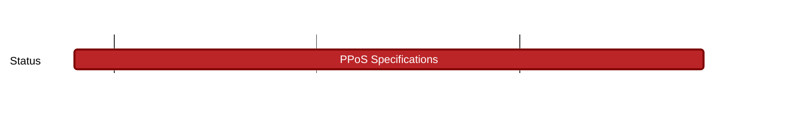

### Description 

In PoS systems, preserving stake privacy is vital to avoid exposing users’ wealth. Different approaches to achieve this include leveraging confidential assets, such as  or coin mixing protocols applied to staking.

### Current Status
Research phase: writing Private Proof of Stake Specifications: 
Due Date: 2023-09-29

