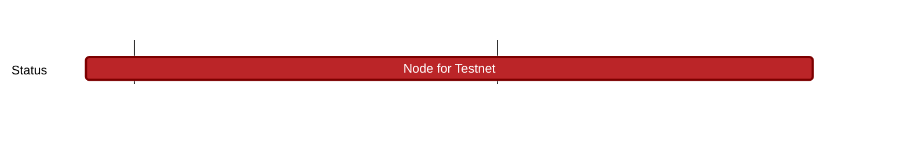
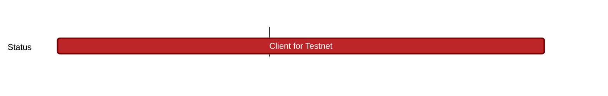
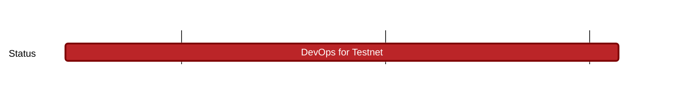

## `nomos:testnet:`
---

### Description

We aim for having an **unstable** testnet (asap) with no guarantees on breaking changes:

- Data can be wiped out at every new rollout
- Accounts may disappear at some point
- There are no incentives initially (ie no token as it requires data permanence)
- A good first functionality target would be to implement something like Bitcoin's ordinals (NFTs), since they are just signed data.

More information: https://www.notion.so/Testnet-55049d959a6145fd9c542c5b3999c65a 

### Research

### Engineering
#### Current Focus

