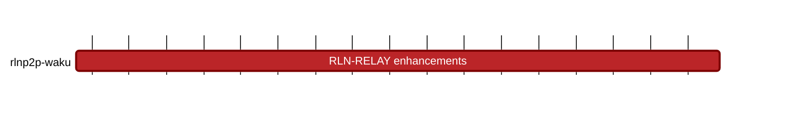

## `vac:acz:rlnp2p::waku:rln-relay-enhancements`
---

- due: 2023/09/30
- status: 70%

### Description
- simple membership management setup (fixed CC list)
- instruction on how to register to the membership set / setup up (for Waku CCs)

#### Goal
Run RLN relay on the Waku production fleet. Waku CCs can use it

### Info

#### 2023/08/21 - 2023/08/28

* tree metadata should include chainId and contractAddress - https://github.com/waku-org/nwaku/pull/1932
* set flush_interval appropriately -https://github.com/waku-org/nwaku/pull/1933
* integrate new WakuRlnRegistry contract - https://github.com/waku-org/nwaku/pull/1943
* bump zerokit to v0.3.2
* https://github.com/waku-org/nwaku/pull/1951
* tree metadata should include window of roots - https://github.com/waku-org/nwaku/pull/1953
* sync tree state from contract deployed block number - https://github.com/waku-org/nwaku/pull/1955
* optimization to waku_keystore - https://github.com/waku-org/nwaku/pull/1956
* fixed a forceProgression bug in the WakuRlnRegistry contract - https://github.com/waku-org/waku-rln-contract/pull/6

#### 2023/08/14 - 2023/08/21
* rpc handler for waku rln relay - https://github.com/waku-org/nwaku/pull/1852
* fixed ganache’s change in method to manage subprocesses, fixed timeouts related to it - https://github.com/waku-org/nwaku/pull/1913
* should error out on rln-relay mount failure - https://github.com/waku-org/nwaku/pull/1904
* fixed invalid start index being used in rln-relay - https://github.com/waku-org/nwaku/pull/1915
* constrain the values that can be used as idCommitments in the rln-contract - https://github.com/vacp2p/rln-contract/pull/26
* assist with waku-simulator testing
* remove registration capabilities from nwaku, it should be done out of band - https://github.com/waku-org/nwaku/pull/1916
* add deployedBlockNumber to the rln-contract for ease of fetching events from the client - https://github.com/vacp2p/rln-contract/pull/27

#### 2023/08/07 - 2023/08/14
*  Created tracking issue to manage status of this milestone - https://github.com/waku-org/nwaku/issues/1906

#### 2023/07/31 - 2023/08/07

* [Waku RLN contract registry](https://github.com/waku-org/waku-rln-contract/pull/3)
* [Mark duplicated messages as spam](https://github.com/waku-org/nwaku/pull/1867)
* [Use `waku-org/waku-rln-contract` as a submodule in `nwaku`](https://github.com/waku-org/nwaku/pull/1884)

### Deliverables

* https://github.com/waku-org/nwaku/issues/1906
