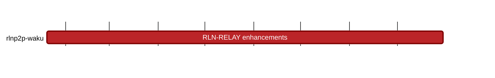

## `vac:acz:rlnp2p::waku:rln-relay-enhancements`
---

- due: 2023/09/30
- status: 50%

### Description
- simple membership management setup (fixed CC list)
- instruction on how to register to the membership set / setup up (for Waku CCs)

#### Goal
Run RLN relay on the Waku production fleet. Waku CCs can use it

### 2023/07/31 - 2023/08/07
- [Waku RLN contract registry](https://github.com/waku-org/waku-rln-contract/pull/3)
- [Mark duplicated messages as spam](https://github.com/waku-org/nwaku/pull/1867)
- [Use `waku-org/waku-rln-contract` as a submodule in `nwaku`](https://github.com/waku-org/nwaku/pull/1884)
- 