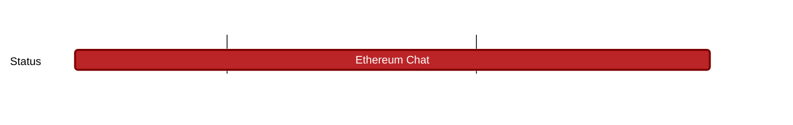

## `vac:acz:secure-channels:waku:ethereum-chat`
---

- status: 0%
- CC: Ramses

### Description

The goal of this milestone is having 

* using the [noise](http://noiseprotocol.org/noise.html) framework
* Ethereum Wallet address used to derive authentication key for noise
* Design an Ethereum address-based 1:1 chat
  - should be transport agnostic
  - toy eth chat: https://rfc.vac.dev/spec/20/
    - this milestone requires forward secrecy (see limitations section of the toy eth chat RFC)
* Naive Groupchat functionality (using `n` 1:1 chat channels)
* involve metamask here (metamask im team)

* a follow up milestone will cover running Ethereum chat on top of Waku
* follow up goal: develop this into an EIP

### Justification

### Deliverables

* specification (RFC) of a secure Ethereum-based chat protocol

