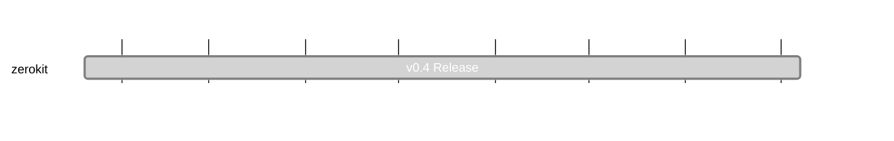

## `vac:acz:zerokit::vac:zerokit-v0.4`
---

```mermaid
%%{ 
  init: { 
    'theme': 'base', 
    'themeVariables': { 
      'primaryColor': '#BB2528', 
      'primaryTextColor': '#fff', 
      'primaryBorderColor': '#7C0000', 
      'lineColor': '#F8B229', 
      'secondaryColor': '#006100', 
      'tertiaryColor': '#fff' 
    } 
  } 
}%%
gantt
	dateFormat YYYY-MM-DD 
	section zerokit
		v0.4 Release :done, 2023-01-20, 2023-09-07
```
- due: 2023/09/07
- status: 0%

### Description
- Release Planning - [Github Issue #197](https://github.com/vacp2p/zerokit/issues/197)