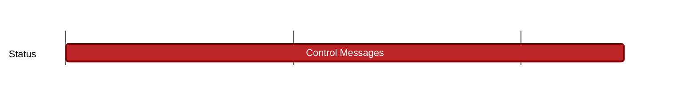

## `vac:dst:analysis-gsub-model:status:control-messages`
---

- status: 85%
- CC: Ganesh

### Description

### Justification

### Info

* delayed because of extending Nomos analysis milestone

### Deliverables

