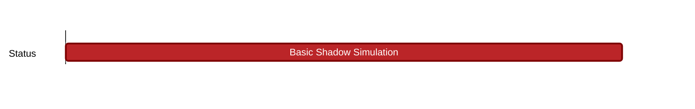

## `vac:dst:analysis-shadow:vac:basic-shadow-simulation`
---

- status: 90%
- CC: Jordi

### Description

* simple 10k shadow sim of the gossipsub node as a PoC.

### Justification

### Deliverables

