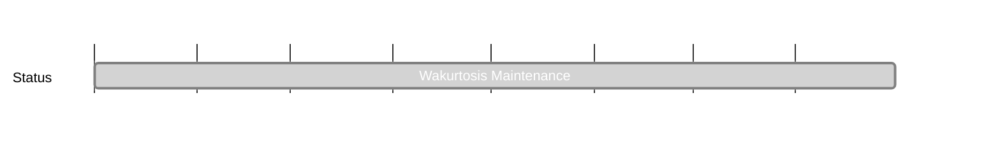

## `vac:dst:wakurtosis:vac:maintenance`
---

- status: 100%
- CC: Alberto

### Description

Keep up to date the tool if there are crashing changes in the services that are being used in it (Waku, Nomos…)

### Justification

Services being used are in constant change, thus it can lead wakurtosis to break.

### Info

* Wakurtosis is deprecated. We do not actively maintain it anymore.

### Deliverables

