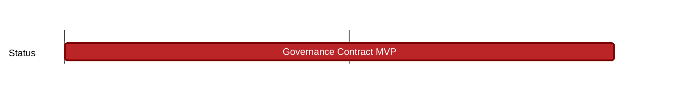

## `vac:sc::status:governance-contract-mvp`
---

- status: 20%
- CC: Ricardo

### Description

* voting within communities
* replace the current community-dapp voting contracts https://github.com/status-im/community-dapp/tree/master/packages/contracts/contracts
* testing is out of scope for that milestone

### Justification

### Deliverables

