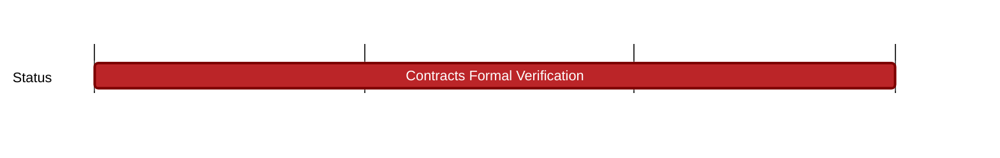

## `vac:sc::codex:contracts-formal-verification`
---

- status: 0%
- CC: r4bbit, gravityblast

### Description

This milestone entails the formal verification of the Codex marketplace smart contracts.
This should be done together with the Codex team as well as with Certora.
Ideally, this will be done by regularly meeting with Certora and reviewing the rules that have been implemented by the Smart Contracts team.

### Justification

Codex is planning to launch a first version of their network by the end of 2024.
To ensure their marketplace system is secure they need to have their code audited and formally verified.

### Deliverables

- Application Properties for the marketplace smart contracts
- Implementation of properties in CVL rules
