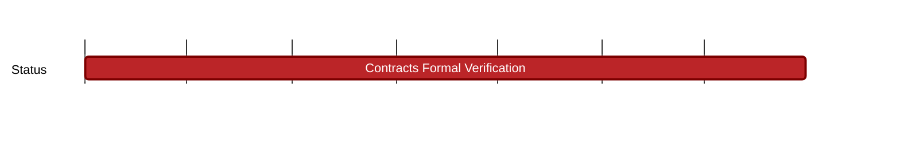

## `vac:sc::finance:access-control-safe-support`
---

- status: 0%
- CC: r4bbit

### Description

The finance team deploys various Safe multisig wallets for different finance strategies to generate yield.
These Safes follow a strict access control architecture by leveraging the Zodiac roles modifier module by Gnosis Guild.

The Smart Contracts team helps deploying these contracts as well as auditing any changes done to the deployment scripts.

### Justification
### Deliverables

