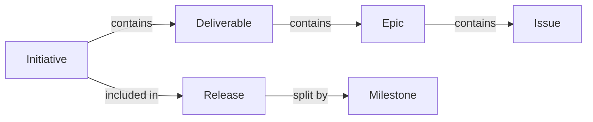

This document defines the terminology used for planning, tracking, and organizing work across IFT projects.

## TL;DR
| Term             | What it is                                                               | Scope              |
| ---------------- | ------------------------------------------------------------------------ | ------------------ |
| [[#Initiative]]  | Top-level work container with outcomes, resources, and risks             | Weeks/months       |
| [[#Release]]     | Timeboxed bundle you ship for testing or external use                    | Single version     |
| [[#Milestone]]   | Zero-duration checkpoint inside a release (e.g., "RC freeze", "go-live") | Single date        |
| [[#Deliverable]] | Tangible outcome produced by an initiative                               | Part of initiative |
| [[#Epic]]        | Large body of work broken into multiple issues                           | Multiple weeks     |
| [[#Issue]]       | Single actionable unit of work                                           | Days to week       |

### *Initiative*

Top-level work container with scope, resources, risks, and multiple deliverables.

**Use when:** Planning and tracking work across weeks/months.
#### Examples

- Create Chat SDK MVP (shipping a versioned bundle)
- API access to P2P Reliability for Desktop (adding product capability)
- Enable easy C-Bindings (infrastructure or tooling)
- Support Discovery Research and Libp2p QUIC (investigation and design)
- Nwaku in Status Mobile/Desktop (cross-project work)
#### Fields
| Field                                | Description                                                                                                        |
| ------------------------------------ | ------------------------------------------------------------------------------------------------------------------ |
| **Objective**                        | Concise statement of what you're accomplishing and why it matters.                                                 |
| **Schedule Window** (or Target Date) | Timeline for delivery (e.g., Q2 2026, or 2026-06-15).                                                              |
| **Resources**                        | Roles and % allocation, external services consumed, infrastructure needs.                                          |
| **Deliverables**                     | Tangible outcomes and their targeted audiences (e.g., Research PoC → Engineering team, SDK → Another IFT project). |
| **Success Metrics**                  | How you measure success. Include User Acquisition and Revenue Generation metrics where applicable.                 |
| **Work Breakdown**                   | Explicit breakdown showing how you plan to deliver. Recommended: Initiative → Deliverable → Epic → Issue.          |
| **Risks (RAID)**                     | Dependencies, assumptions, potential market changes, and other factors that affect delivery.                       |
| **Monitoring Links**                 | Links to dashboards, GitHub Projects, tracking issues, or other monitoring tools.                                  |
| **FURPS**                            | Link to or define quality dimensions (Functionality, Usability, Reliability, Performance, Supportability) for this initiative's scope. |
| **Includes in Releases**             | List of releases (e.g., v0.1, v0.2, Testnet v0.1) that include this initiative's deliverables.                     |

### *Release*

Cross-team, timeboxed bundle you ship for testing or external use.
#### Examples

- Testnet v0.1
- Testnet v0.2
- Mainnet v1.0
#### Fields
| Field                     | Description                                                                            |
| ------------------------- | -------------------------------------------------------------------------------------- |
| **Release Window**        | Target timeframe for the release.                                                      |
| **Scope**                 | High-level description of what's included.                                             |
| **Includes Initiatives**  | List of initiatives whose deliverables are part of this release, grouped by components |
| **Milestones** (optional) | Key checkpoints with dates (e.g., Feature Freeze: 2026-05-01, Go-Live: 2026-06-01).    |

### *Milestone*

Zero-duration gate inside a Release.

**Use sparingly:** For single dates, not as work containers.

> [!NOTE] Do not confuse with Initiative
> An Initiative is a scoped outcome package spanning weeks/months. 
> A Milestone checkpoint marks a specific moment in time.
#### Examples

- "RC freeze"
- "go-live
- "post-mortem"

---
## Initiative Breakdown

Initiatives should be broken down into smaller units of work for planning and execution.

> [!TIP] Component teams can adapt this based on their needs.
> Recommended hierarchy: Initiative → Deliverable → Epic → Issue

### *Deliverable*

Tangible outcome produced by an initiative with a specific audience (e.g., Engineering team, external users, another IFT project). Can be shipped or handed off.
#### FURPS

Deliverables should reference relevant quality dimensions from your initiative's FURPS documentation. Each deliverable lists which FURPS categories it addresses (e.g., F1: "User can...", U2: "Interface supports...").

Ensures holistic coverage across Functionality, Usability, Reliability, Performance, and Supportability
#### Examples

- SDK release
- Research report
- API implementation
- Documentation

### *Epic*

Large body of work that can be broken down into multiple issues, representing a significant feature or capability within an initiative. Takes multiple sprints/weeks to complete and is aligned with one or more deliverables.
#### Examples

- Implement message persistence
- Build testing framework
- Design and implement authentication

### *Issue*

Single, specific unit of work that can be completed in a short time frame (typically days, not weeks). Actionable and well-defined with clear acceptance criteria. Tracked in GitHub or similar tool.
#### Examples

- Add error handling to send message API
- Write unit tests for encryption module
- Update README with installation steps
