> [!NOTE] This diagram shows the component dependencies for [[v01|Testnet v0.1]]. It illustrates how modules, apps, and infrastructure components relate to each other.

```mermaid
flowchart TB
    subgraph LogosCore["Logos Core Platform"]
        liblogos["liblogos<br/>(Module Loader)"]
        LogosApp["Logos App<br/>(UI Platform)"]
        LogosNode["Logos Node<br/>(Headless Mode)"]
    end

    subgraph Modules["Logos Core Modules"]
        BlockchainNode["Blockchain Node<br/>Module"]
        BlockchainWallet["Blockchain Wallet<br/>Module"]
        LEZWallet["LEZ Wallet<br/>Module"]
        LEZExplorer["LEZ Blockexplorer<br/>Module"]
        StorageNode["Storage Node<br/>Module"]
        ChatNode["Chat Node<br/>(ChatSDK Interface)"]
        LMNModule["LMN Module<br/>(Early Version)"]
        MixModule["Mix Module<br/>(PoC)"]
    end

    subgraph SimpleApps["Simple Apps (UIs in Logos App)"]
        WalletUI["Blockchain/LEZ<br/>Wallet UI"]
        ChatApp["Simple Chat App<br/>(1:1 Chat)"]
        FilesharingApp["Simple Filesharing<br/>App"]
        MixApp["Simple Mix Push<br/>Message App"]
    end

    subgraph Blockchain["Blockchain Infrastructure"]
        Cryptarchia["Cryptarchia<br/>(PPoS Consensus)"]
        BlendNetwork["Blend Network"]
        LEZSequencer["LEZ Centralized<br/>Sequencer"]
        Faucet["Token Faucet"]
    end

    subgraph AnonComms["AnonComms Infrastructure"]
        CapabilityDiscovery["Capability Discovery<br/>Protocol"]
        Libp2pMixnet["libp2p Mixnet"]
    end

    subgraph Storage["Storage Infrastructure"]
        StorageBackend["Storage Backend<br/>(CID-based)"]
    end

    subgraph Messaging["Messaging Infrastructure"]
        LMNEmbedded["LMN<br/>(Embedded in Chat Node)"]
    end

    %% Logos Core relationships
    liblogos --> BlockchainNode
    liblogos --> BlockchainWallet
    liblogos --> LEZWallet
    liblogos --> LEZExplorer
    liblogos --> StorageNode
    liblogos --> ChatNode
    liblogos --> LMNModule
    liblogos --> MixModule

    LogosNode --> BlockchainNode
    LogosNode --> StorageNode
    LogosNode --> ChatNode

    LogosApp --> WalletUI
    LogosApp --> ChatApp
    LogosApp --> FilesharingApp
    LogosApp --> MixApp

    %% Module dependencies
    BlockchainWallet --> BlockchainNode
    LEZWallet --> BlockchainNode
    LEZWallet --> LEZSequencer
    LEZExplorer --> BlockchainNode
    LEZExplorer --> LEZSequencer

    ChatNode --> LMNEmbedded

    MixModule --> CapabilityDiscovery
    MixModule --> Libp2pMixnet

    %% App to Module dependencies
    WalletUI --> BlockchainWallet
    WalletUI --> LEZWallet
    WalletUI --> Faucet
    ChatApp --> ChatNode
    FilesharingApp --> StorageNode
    MixApp --> MixModule

    %% Infrastructure dependencies
    BlockchainNode --> Cryptarchia
    BlockchainNode --> BlendNetwork
    LEZSequencer --> BlockchainNode
    StorageNode --> StorageBackend

    %% Styling
    classDef core fill:#4a90d9,stroke:#2d5a87,color:#fff
    classDef module fill:#67b26f,stroke:#3d6b41,color:#fff
    classDef app fill:#f5a623,stroke:#b37a1a,color:#fff
    classDef infra fill:#9b59b6,stroke:#6c3d80,color:#fff
    classDef anoncomms fill:#e74c3c,stroke:#a33527,color:#fff
    classDef storage fill:#1abc9c,stroke:#128c74,color:#fff
    classDef messaging fill:#3498db,stroke:#246a99,color:#fff

    class liblogos,LogosApp,LogosNode core
    class BlockchainNode,BlockchainWallet,LEZWallet,LEZExplorer,StorageNode,ChatNode,LMNModule,MixModule module
    class WalletUI,ChatApp,FilesharingApp,MixApp app
    class Cryptarchia,BlendNetwork,LEZSequencer,Faucet infra
    class CapabilityDiscovery,Libp2pMixnet anoncomms
    class StorageBackend storage
    class LMNEmbedded messaging
```

## Component Legend

| Color | Category | Description |
|-------|----------|-------------|
| Blue | Logos Core | Core platform components |
| Green | Modules | Logos Core modules (loaded by liblogos) |
| Orange | Simple Apps | User-facing applications in Logos App |
| Purple | Blockchain Infra | Blockchain infrastructure components |
| Red | AnonComms | Anonymous communications infrastructure |
| Teal | Storage | Storage infrastructure |
| Light Blue | Messaging | Messaging infrastructure |

## Key Dependencies

### Logos Core Platform
- **liblogos** loads all modules from Github
- **Logos App** hosts all Simple App UIs
- **Logos Node** runs headless mode with Blockchain, Storage, and ChatSDK nodes

### Module Dependencies
- **Blockchain Wallet** and **LEZ Wallet** depend on the **Blockchain Node** for transaction processing
- **LEZ** modules depend on the **LEZ Centralized Sequencer** which settles on the blockchain
- **Chat Node** embeds **LMN** (will be separated in [[v02|v0.2]])
- **Mix Module** uses **Capability Discovery Protocol** and **libp2p Mixnet**

### Infrastructure
- **Blockchain Node** uses **Cryptarchia** for PPoS consensus and **Blend Network** for networking
- **LEZ Sequencer** settles on blockchain via inscriptions
- **Storage Node** provides CID-based file storage/retrieval

## Notes

- All modules expose RPC interfaces for external interaction
- LEZ Sequencer is centralized in v0.1; decentralized version planned for [[v02|v0.2]]
- Mix functionality will integrate into Chat App in v0.2
- LMN Module exists separately but is not yet used by ChatSDK in v0.1
