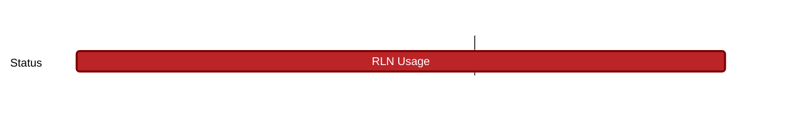

## `vac:acz:rlnp2p:status:rln-usage`
---

- status: 0%
- CC: Aaryamann

### Description

To describe an end-to-end user flow for a new user of the status app on how they can acquire an RLN membership.
### Justification

Status will use RLN in the future, and we must first consult them on how to use it for seamless integration.

### Deliverables

- [ ] Document describing end-to-end user flow

