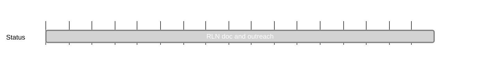

## `vac:acz:rlnp2p:vac:rln-doc-and-outreach`
---

- status: 100%
- CC: Aaryamann

### Description

* Waku doc: How can a user setup Waku + RLN?
  - even though Waku RLN does not support slashing yet, we can see RLN as that provides an additional datapoint regarding message validity
* doc explaining how the components of RLN (zerokit, contract, and a project using it, e.g. Waku, work together)
  - this can be in notion at first
* rlog post based on the two points above
* talk @ progcrypto and logos event in Istanbul (co-located with devconnect)

### Justification

### Deliverables

* [x] talk at progcrypto on RLN: https://www.youtube.com/watch?v=7xDxv8F70Jg&pp=ygUOcHJvZ2NyeXB0byBybG4%3D
* [x] presented rln: zero to hero to nwaku+chatsdk team @ status all hands, explained all versions of rln and their trade-offs
- [ ] blog post/RFC on Light RLN verifiers: https://github.com/vacp2p/vac.dev/pull/136
- [x] updated docs for rln-relay in nwaku-compose: [https://github.com/waku-org/nwaku-compose/pull/52](https://github.com/waku-org/nwaku-compose/pull/52)
- [x] Present rln-v2 and v3 at logos research call: https://docs.google.com/presentation/d/1lcE5E3WKenueIULR_rhjtZU8Tdqv-7sPr6lpXPTaQSk/edit?usp=sharing
- [x] RLN rlog on vac.dev: https://vac.dev/rlog/rln-anonymous-dos-prevention

