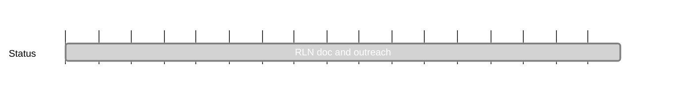

## `vac:acz:rlnp2p:vac:rln-doc-and-outreach`
---

- status: 100%
- CC: Aaryamann

### Description

* Waku doc: How can a user setup Waku + RLN?
  - even though Waku RLN does not support slashing yet, we can see RLN as that provides an additional datapoint regarding message validity
* doc explaining how the components of RLN (zerokit, contract, and a project using it, e.g. Waku, work together)
  - this can be in notion at first
* rlog post based on the two points above
* talk @ progcrypto and logos event in Istanbul (co-located with devconnect)

### Justification

### Deliverables

* todo: list

