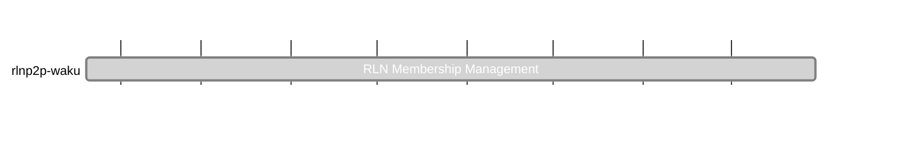

## `vac:acz:rlnp2p::waku:rln-membership-management`
---

- due: 2023/09/30
- status: 100%

### Description
Enhancing the first simple CC membership list

### Risks
- depends on input from [[waku/index|Waku]]

### Info

#### 2023/09/04 - 2023/09/11

* added documentation for rln_keystore_generator - https://github.com/waku-org/nwaku/pull/1993

#### 2023/08/28 - 2023/09/04

* fixed makefile target for rln_keystore_generator - https://github.com/waku-org/nwaku/pull/1960
* log the membership index out upon registration in the rln_keystore_generator - https://github.com/waku-org/nwaku/pull/1963

#### 2023/08/21 - 2023/08/28

* Demo of rln_keystore_generator: https://github.com/waku-org/nwaku/pull/1956
* Wrote a tool rln_keystore_generator
  * https://github.com/waku-org/nwaku/pull/1925
  * https://github.com/waku-org/nwaku/pull/1928
  * https://github.com/waku-org/nwaku/pull/1931
